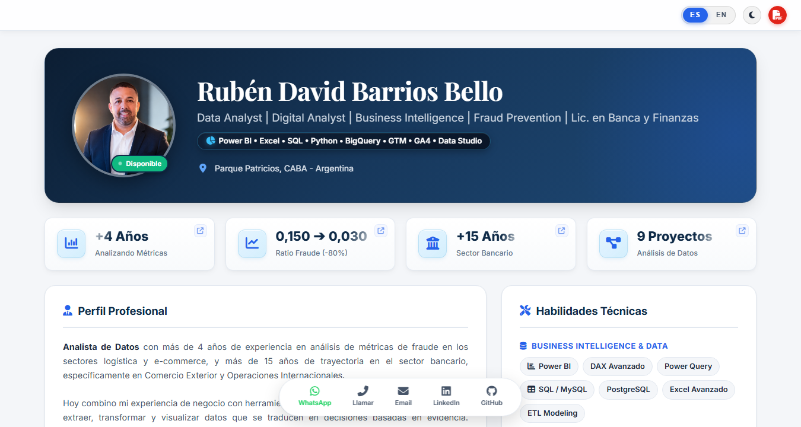
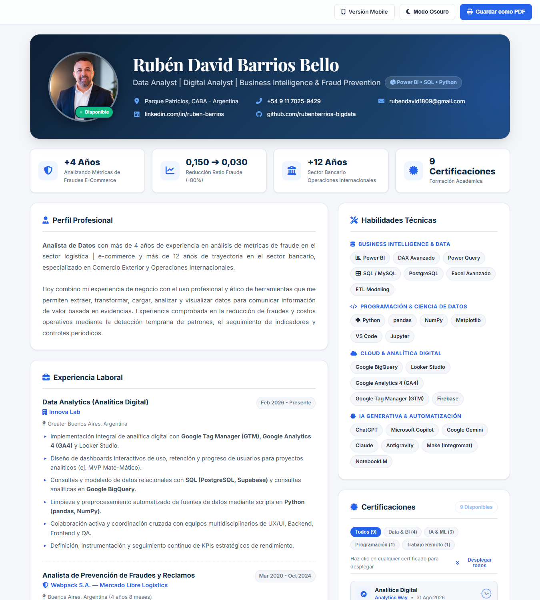
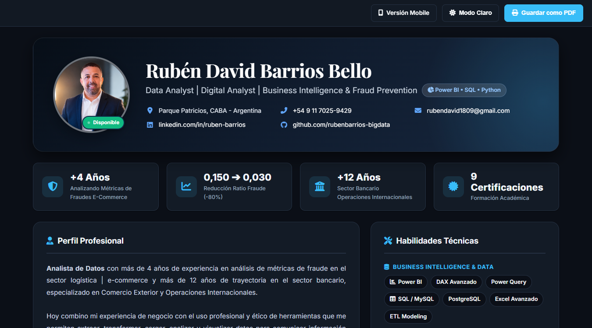
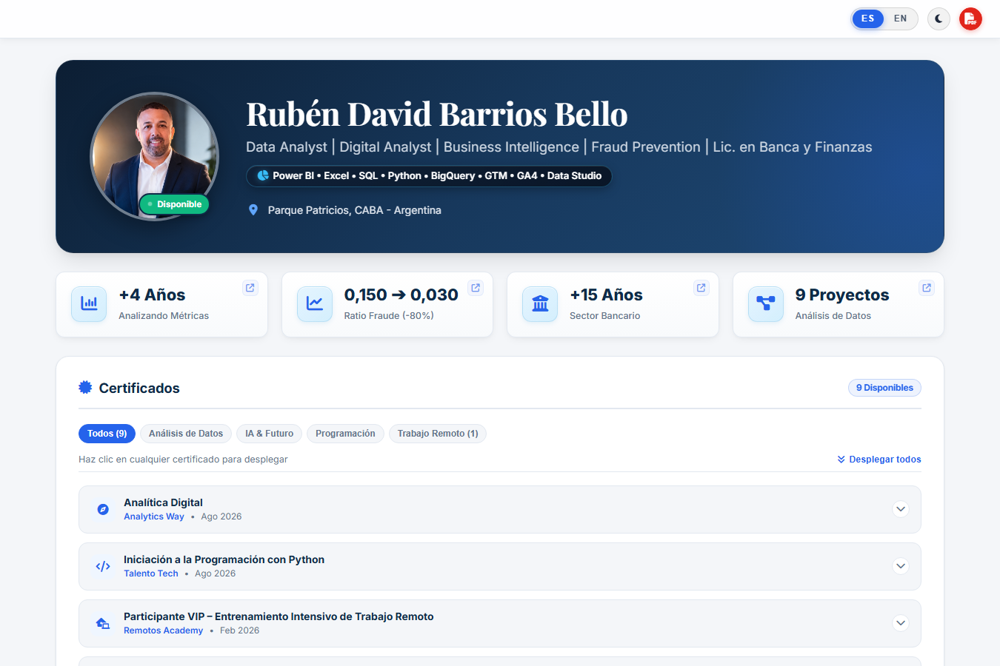

# 📊 CV Interactivo: Rubén David Barrios Bello

<div align="center">

[](https://rubenbarrios-bigdata.github.io/cv-html-ruben-barrios/)
[](https://rubenbarrios-bigdata.github.io/cv-html-ruben-barrios/CV_Ruben_Barrios.html)
[](https://www.linkedin.com/in/ruben-barrios)
[](https://github.com/rubenbarrios-bigdata)

<br>


-000000?style=flat-square&logo=json&logoColor=white)


<br>

### 💡 *"CV con mentalidad de dashboard — 4 KPIs clave sobre mi perfil profesional"*

**Data Analyst | Digital Analyst | Business Intelligence | Fraud Prevention | Lic. en Banca y Finanzas**

</div>

---

## 📄 Archivos del CV en HTML Incluidos en el Repositorio

El repositorio incluye el **CV completo en formato HTML nativo**, estructurado como una aplicación web moderna, interactiva, responsiva y auto-contenida:

| Formato | Archivo en el Repositorio | Enlace de Visualización Directa | Descripción |
| :--- | :--- | :--- | :--- |
| **CV Web Desktop (HTML Principal)** | [`CV_Ruben_Barrios.html`](CV_Ruben_Barrios.html) & [`index.html`](index.html) | 🌐 [Abrir CV Web en GitHub Pages](https://rubenbarrios-bigdata.github.io/cv-html-ruben-barrios/CV_Ruben_Barrios.html) | Experiencia interactiva completa: 4 KPIs dinámicos, navegación por anclas, alternador de Modo Oscuro/Claro y filtros de certificaciones. |
| **CV Web Mobile (HTML)** | [`CV_Ruben_Barrios_Mobile.html`](CV_Ruben_Barrios_Mobile.html) & [`mobile.html`](mobile.html) | 📱 [Abrir versión Mobile en GitHub Pages](https://rubenbarrios-bigdata.github.io/cv-html-ruben-barrios/CV_Ruben_Barrios_Mobile.html) | Versión adaptada con navegación vertical optimizada para pantallas táctiles de celulares. |
| **Descarga Directa del Código HTML** | [`CV_Ruben_Barrios.html`](CV_Ruben_Barrios.html) | 📥 [Descargar archivo .html](https://raw.githubusercontent.com/rubenbarrios-bigdata/cv-html-ruben-barrios/main/CV_Ruben_Barrios.html) | Podés descargarlo y abrirlo con doble clic en cualquier navegador (Chrome, Edge, Safari, Firefox) sin necesidad de internet ni servidores. |
| **Versión en Documento PDF** | [`CV_Ruben_Barrios_Analista_De_Datos.pdf`](CV_Ruben_Barrios_Analista_De_Datos.pdf) | 📕 [Ver / Descargar PDF](https://github.com/rubenbarrios-bigdata/cv-html-ruben-barrios/raw/main/CV_Ruben_Barrios_Analista_De_Datos.pdf) | Documento tradicional listo para adjuntar en sistemas de selección ATS o procesos estándar. |

> 💡 **Ventaja de un CV en HTML para un Analista de Datos**:
> Presentar el currículum en formato HTML demuestra en la práctica conocimientos fundamentales en tecnologías web (DOM, CSS, JavaScript, JSON y APIs), habilidades indispensables para la implementación de analítica digital (GA4, GTM), medición de eventos y desarrollo de interfaces interactivas de Business Intelligence.

---

## 🎯 El Enfoque: "CV con Mentalidad de Dashboard"

En el análisis de datos, el valor no reside únicamente en listar responsabilidades acumuladas, sino en **comunicar métricas de impacto, ratios de eficiencia y evidencia cuantificable** desde el primer contacto visual.

Este CV fue concebido e implementado bajo los principios de diseño de un **Executive Dashboard**:
- **Consumo rápido de insights**: El reclutador o líder de datos visualiza de inmediato 4 indicadores clave que resumen más de 16 años de trayectoria profesional combinada.
- **Trazabilidad y navegación orientada a métricas**: Cada tarjeta de KPI actúa como un elemento interactivo que redirige hacia el contexto específico del proyecto o logro que respalda ese número.
- **Mentalidad analítica en el código**: Demuestra cómo un analista aborda un producto digital, aplicando estándares modernos de desacoplamiento de datos y diseño responsive.

---

## 📈 Los 4 KPIs Estratégicos

| KPI | Métrica Clave | Enfoque de Negocio & Impacto Analítico |
| :---: | :---: | :--- |
| <div align="center"></div> | **`+4 Años`**<br><sub>Fraudes E-Commerce</sub> | **Detección temprana y control de riesgos:** Análisis de métricas transaccionales, detección de anomalías y prevención de contracargos en operaciones de alto volumen para logística y comercio electrónico. |
| <div align="center"></div> | **`0,150 ➔ 0,030`**<br><sub>Reducción Ratio Fraude</sub> | **Impacto económico directo:** Descenso del **80%** en el ratio de fraude mediante la optimización de reglas de negocio, scoring predictivo y seguimiento periódico de indicadores de riesgo. |
| <div align="center"></div> | **`+12 Años`**<br><sub>Sector Bancario</sub> | **Sólido criterio de negocio y finanzas:** Dominio operativo en Comercio Exterior, Operaciones Internacionales, conciliaciones transaccionales y normativas cambiarias bancarias. |
| <div align="center"></div> | **`9 Proyectos`**<br><sub>Análisis de Datos</sub> | **Soluciones analíticas aplicadas:** Portafolio técnico de dashboards y productos de datos en Power BI, DAX, Excel Avanzado, SQL, Python, GTM, GA4 y Data Studio. |

---

## 📸 Capturas de Pantalla del CV Renderizado

### 1. Banner Ejecutivo de KPIs y Perfil Profesional
Visualización en modo claro destacando los 4 indicadores clave y la síntesis de perfil:

<div align="center">
  
</div>

---

### 2. Vista Panorámica Desktop (Experiencia Laboral y Stack Técnico)
Distribución tipo dashboard de dos columnas con experiencia estructurada y matriz de habilidades:

<div align="center">
  
</div>

---

### 3. Modo Oscuro (Dark Theme Ejecutivo)
Soporte completo para tema oscuro con paleta HSL optimizada para reducir fatiga visual y resaltar contrastes analíticos:

<div align="center">
  
</div>

---

### 4. Centro Interactivo de Certificaciones con Filtros por Categoría
Explorador interactivo con filtrado dinámico (`Data & BI`, `IA & ML`, `Programación`, `Trabajo Remoto`) y enlaces a credenciales oficiales verificadas (Credly, BadgeClaimed, OpenBadgeFactory):

<div align="center">
  
</div>

---

### 5. Experiencia Mobile Optimizada
Diseño responsivo nativo adaptado a dispositivos móviles para lectura ágil durante procesos de selección:

<div align="center">
  
</div>

---

## 🏗️ Arquitectura Técnica: Separación de Capas (Data Layer vs. Presentation)

Como prueba del criterio analítico y de ingeniería de software, los datos del dashboard no están rígidamente acoplados al documento HTML. Se implementó una **arquitectura desacoplada**:

```
├── data.json                   <-- [CAPA DE DATOS] Fuente única de verdad (KPIs y metadata)
├── CV_Ruben_Barrios.html       <-- [CV EN HTML] Documento web principal con diseño dashboard
├── index.html                  <-- [PÁGINA RAÍZ] Entry point de GitHub Pages
├── CV_Ruben_Barrios_Mobile.html<-- [CV HTML MOBILE] Versión adaptada a smartphones
├── mobile.html                 <-- Alias para versión móvil
├── certs_images/               <-- Assets gráficos de credenciales y certificaciones
└── screenshots/                <-- Capturas del render visual en alta definición
```

### ¿Cómo funciona la carga dinámica?
1. **Fuente de Datos Centralizada (`data.json`)**:
   Las métricas, descripciones, tooltips e iconos se administran en un esquema JSON estructurado. Modificar un KPI no requiere editar la plantilla HTML.
2. **Consumo Asíncrono (`fetch API`)**:
   Al inicializarse la página en GitHub Pages, una función asíncrona (`async/await`) consume `data.json` e inyecta dinámicamente las tarjetas de indicadores en el contenedor `#statsBanner`.
3. **Resiliencia con Fallback Progresivo**:
   Si el archivo se abre localmente por doble clic (`file:///`) en un entorno donde las políticas de seguridad CORS del navegador restringen peticiones locales, el sistema activa automáticamente un fallback pre-renderizado, garantizando que el usuario jamás vea un estado en blanco o roto.

---

## 🔗 Despliegue en GitHub Pages & LinkedIn

### 🌐 Acceso al CV en Vivo:
El CV interactivo se encuentra publicado y operativo a través de **GitHub Pages**:
- **Versión Principal**: [https://rubenbarrios-bigdata.github.io/cv-html-ruben-barrios/](https://rubenbarrios-bigdata.github.io/cv-html-ruben-barrios/)
- **Enlace directo al HTML**: [https://rubenbarrios-bigdata.github.io/cv-html-ruben-barrios/CV_Ruben_Barrios.html](https://rubenbarrios-bigdata.github.io/cv-html-ruben-barrios/CV_Ruben_Barrios.html)

### 💼 Cómo destacar este proyecto en LinkedIn:

Para maximizar la visibilidad ante reclutadores técnicos y hiring managers en LinkedIn:

1. **Sección "Destacados" (Featured) del Perfil de LinkedIn**:
   - En tu perfil de LinkedIn, hacé clic en **Añadir sección** ➔ **Destacados** ➔ **+ Enlaces**.
   - Pegá la URL: `https://rubenbarrios-bigdata.github.io/cv-html-ruben-barrios/`
   - **Título**: `📊 CV Interactivo — Dashboard de Métricas Profesionales & Data Analytics`
   - **Descripción**: `Mi CV interactivo estructurado como un dashboard ejecutivo con 4 KPIs clave sobre mi trayectoria en prevención de fraudes, finanzas bancarias y analítica de datos.`
   - Podés adjuntar como miniatura la captura `screenshots/01_kpis_dashboard_header.png`.

2. **Enlace de Contacto / Encabezado de Perfil**:
   - Editá tu información de contacto en LinkedIn.
   - En el campo **Sitio Web**, seleccioná tipo *"Portafolio"* o *"Personal"* e ingresá el link de GitHub Pages.

3. **Publicación en el Feed de LinkedIn (Post de Alto Impacto)**:
   - Compartí una breve reflexión sobre por qué los analistas de datos deberían estructurar su experiencia orientada a KPIs y métricas cuantificables, adjuntando la captura en modo oscuro y el enlace a la versión interactiva.

---

## 🛠️ Tecnologías Utilizadas

- **Frontend Core**: HTML5 Semántico, CSS3 Moderno (Variables CSS / Tokens de Diseño, Glassmorphism, CSS Grid & Flexbox).
- **Lógica & Reactividad**: JavaScript Vanilla (ES6+) con `fetch API`, `async/await`, y persistencia de temas mediante `localStorage`.
- **Capa de Datos**: JSON estructurado (`data.json`) desacoplado de la UI.
- **Tipografía & Estética**: Google Fonts (*Inter*, *Playfair Display*), FontAwesome 6.
- **Exportabilidad**: Hojas de estilo `@media print` optimizadas para generar PDF limpio sin cortes indeseados.

---

## 💻 Visualización y Ejecución Local

Podés abrir y ejecutar este proyecto de tres formas sencillas:

### Opción 1: Abrir directamente el archivo HTML (Sin instalar nada)
Simplemente hacé doble clic en el archivo [`CV_Ruben_Barrios.html`](CV_Ruben_Barrios.html) o [`index.html`](index.html). Se abrirá automáticamente en tu navegador predeterminado (Chrome, Edge, Firefox, etc.).

### Opción 2: Clonar y servir con servidor local
```bash
# 1. Clonar el repositorio
git clone https://github.com/rubenbarrios-bigdata/cv-html-ruben-barrios.git

# 2. Ingresar a la carpeta
cd cv-html-ruben-barrios

# 3. Iniciar un servidor local (con Python)
python -m http.server 8000
```
Luego abrí tu navegador en: `http://localhost:8000`

---

## 📩 Contacto

- **Nombre**: Rubén David Barrios Bello
- **Ubicación**: Parque Patricios, CABA — Argentina
- **Teléfono**: [+54 9 11 7025-9429](tel:+5491170259429)
- **Email**: [rubendavid1809@gmail.com](mailto:rubendavid1809@gmail.com)
- **LinkedIn**: [linkedin.com/in/ruben-barrios](https://www.linkedin.com/in/ruben-barrios)
- **GitHub**: [github.com/rubenbarrios-bigdata](https://github.com/rubenbarrios-bigdata)
