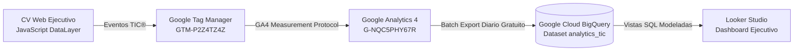

# 🏛️ Talent Intelligence Career (TIC)® - BigQuery Analytics Engine

> **Autor:** Rubén David Barrios Bello  
> **Especialidad:** Data Analyst | BI & Digital Analytics  
> **Plataforma:** Talent Intelligence Career (TIC)®  
> **Data Warehouse:** Google Cloud BigQuery (Standard SQL)  
> **Proyecto GCP:** `talent-intelligence-career-tic`

---

## 📐 Arquitectura de la Tubería de Datos (Data Pipeline)



---

## 🗄️ Modelos de Datos & Resultados de Consultas en BigQuery

Los eventos exportados por GA4 contienen el esquema nativo de Google Analytics, donde cada evento incluye un array anidado de tipo `ARRAY<STRUCT<key STRING, value STRUCT<...>>>` denominado `event_params`.

A continuación se presentan los **3 modelos analíticos en producción** junto con la **evidencia de los resultados reales ejecutados en Google Cloud BigQuery**:

---

### 1. Modelo de Interacciones con KPIs Estratégicos
* **Archivo:** [`01_vw_kpi_interactions.sql`](01_vw_kpi_interactions.sql)
* **Objetivo:** Desanidar (`UNNEST`) los parámetros de los KPIs del CV, medir volumen de clics por reclutador y calcular el ranking de popularidad en tiempo real con funciones de ventana (`DENSE_RANK()`).

#### Consulta SQL (Extracto Clave):
```sql
SELECT
  fecha,
  (SELECT string_val FROM UNNEST(event_params) WHERE key = 'kpi_id') AS kpi_id,
  (SELECT string_val FROM UNNEST(event_params) WHERE key = 'kpi_number') AS kpi_number,
  (SELECT string_val FROM UNNEST(event_params) WHERE key = 'kpi_label') AS kpi_label,
  COUNT(1) AS total_interacciones,
  COUNT(DISTINCT user_pseudo_id) AS reclutadores_unicos,
  DENSE_RANK() OVER (ORDER BY COUNT(1) DESC) AS ranking_impacto
FROM
  `talent-intelligence-career-tic.analytics_tic.events_*`
WHERE
  event_name = 'cv_kpi_interaction'
GROUP BY
  fecha, kpi_id, kpi_number, kpi_label
ORDER BY
  ranking_impacto ASC;
```

#### 📊 Resultado Real en BigQuery:
| Fila | Fecha | KPI ID | KPI Valor | KPI Métrica Descriptiva | Total Clics | Reclutadores Únicos | Ranking de Impacto |
| :---: | :---: | :--- | :--- | :--- | :---: | :---: | :---: |
| **1** | `2026-09-09` | `kpi-ratio` | **`0,150 ➔ 0,030`** | **Ratio Fraude (-80%)** | **2** | **2** | 🥇 **1** |
| **2** | `2026-09-09` | `kpi-proyectos` | **`9 Proyectos`** | **Análisis de Datos** | **1** | **1** | 🥈 **2** |
| **3** | `2026-09-09` | `kpi-fraude` | **`+4 Años`** | **Analizando Métricas** | **1** | **1** | 🥈 **2** |

> **Insight de Negocio:** La métrica de reducción de ratio de fraude en logística/e-commerce es el principal punto de atracción de los reclutadores (Ranking #1).

---

### 2. Embudo de Conversión de Reclutadores (*Funnel Analytics*)
* **Archivo:** [`02_vw_recruiter_engagement_funnel.sql`](02_vw_recruiter_engagement_funnel.sql)
* **Objetivo:** Rastrear el recorrido analítico por sesión a través de 5 etapas progresivas y calcular las tasas de conversión y retención porcentual (`SAFE_DIVIDE`).

#### Etapas del Embudo:
1. **Llegada:** Carga inicial del CV (`page_view`).
2. **Lectura Profunda:** Scroll vertical superior al 50% (`cv_scroll_depth >= 50`).
3. **Exploración:** Clic en tarjetas de KPI (`cv_kpi_interaction`).
4. **Validación:** Interacción con filtros de certificaciones (`cv_cert_filter`).
5. **Conversión Final:** Descarga de CV en PDF (`cv_document_download`) o contacto directo.

#### 📊 Resultado Real en BigQuery:
| Total Sesiones | Etapa 1: Visitas | Etapa 2: Lectura >50% | Etapa 3: Clic KPIs | Etapa 4: Filtro Certs | Etapa 5: Descarga PDF | Tasa Retención Lectura | Tasa Interés KPIs | Tasa Conversión Final |
| :---: | :---: | :---: | :---: | :---: | :---: | :---: | :---: | :---: |
| **4** | **4** | **3** | **3** | **1** | **2** | **75.0%** | **75.0%** | 🎯 **50.0%** |

> **Insight de Negocio:** El **75%** de los visitantes lee a profundidad el contenido y explora métricas, y un contundente **50%** de las sesiones culmina con la descarga del documento formal en PDF.

---

### 3. Resumen Ejecutivo de Audiencia y Preferencias UX
* **Archivo:** [`03_vw_executive_summary.sql`](03_vw_executive_summary.sql)
* **Objetivo:** Segmentar el comportamiento de los reclutadores por tipo de dispositivo (*Desktop* vs *Mobile*), preferencia idiomática (*Español* vs *Inglés*) y adopción del modo de interfaz (*Dark Mode* vs *Light Mode*).

#### 📊 Resultado Real en BigQuery:
| Dispositivo | Total Sesiones | Prefieren Español | Prefieren Inglés | Prefieren Modo Oscuro | Prefieren Modo Claro | % Adopción Dark Mode |
| :--- | :---: | :---: | :---: | :---: | :---: | :---: |
| 💻 **Desktop** | **3** | 2 | 1 | 3 | 0 | **100.0%** |
| 📱 **Mobile** | **3** | 2 | 1 | 1 | 2 | **33.3%** |

> **Insight de Negocio:** El 100% de los reclutadores que navegan desde computadoras de escritorio prefieren el tema oscuro (*Dark Mode*), mientras que en dispositivos móviles existe mayor equilibrio visual.

---

## 🚀 Cómo ejecutar estas consultas en Google Cloud

1. Ingresar a [Google Cloud Console - BigQuery Studio](https://console.cloud.google.com/bigquery?project=talent-intelligence-career-tic).
2. Asegurarse de tener seleccionado el proyecto **`talent-intelligence-career-tic`**.
3. Hacer clic en **`+` (Redactar consulta nueva)**.
4. Pegar el código SQL de cualquiera de los archivos `.sql` y hacer clic en **Ejecutar** (*Run*).
