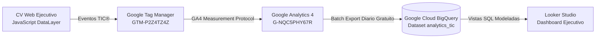

# 🏛️ Talent Intelligence Career (TIC)® - BigQuery Analytics Engine

> **Autor:** Rubén David Barrios Bello  
> **Especialidad:** Data Analyst | BI & Digital Analytics  
> **Plataforma:** Talent Intelligence Career (TIC)®  
> **Data Warehouse:** Google Cloud BigQuery (Standard SQL)  
> **Proyecto GCP:** `talent-intelligence-career-tic`

---

## 📐 Arquitectura de la Tubería de Datos (Data Pipeline)

---

## 🗄️ Modelos de Datos en BigQuery (`/sql`)

Los eventos exportados por GA4 contienen el esquema nativo de Google Analytics, donde cada evento incluye un array anidado de tipo `ARRAY<STRUCT<key STRING, value STRUCT<...>>>` llamado `event_params`.

Para disponibilizar estos datos en dashboards analíticos y reportes ejecutivos, se implementaron 3 vistas SQL de ingeniería de datos:

### 1. `01_vw_kpi_interactions.sql`
* **Propósito:** Desanida los parámetros de eventos `cv_kpi_interaction`.
* **Dimensiones extraídas:** `candidate_id`, `kpi_id`, `kpi_number`, `kpi_label`, `target_anchor`.
* **Métricas calculadas:** Total histórico de clics por KPI, ranking diario de impacto con funciones de ventana (`DENSE_RANK()`).

### 2. `02_vw_recruiter_engagement_funnel.sql`
* **Propósito:** Construye el embudo de conversión del reclutador por sesión.
* **Etapas del Embudo:**
  1. *Llegada al CV* (`page_view`)
  2. *Lectura Profunda 50%+* (`cv_scroll_depth`)
  3. *Exploración de Métricas de Negocio* (`cv_kpi_interaction`)
  4. *Validación Técnica de Certificados* (`cv_cert_filter`)
  5. *Conversión Final* (`cv_document_download` o `cv_external_click`)
* **KPIs de Tasa:** Tasa de Retención de Lectura %, Tasa de Engagement de KPIs %, Tasa de Conversión Final %.

### 3. `03_vw_executive_summary.sql`
* **Propósito:** Agregación ejecutiva diaria por fecha, país y dispositivo.
* **Métricas:** Usuarios únicos, sesiones totales, pageviews, interacciones con KPIs, descargas de CV PDF y preferencias de UX (modo oscuro vs claro, idioma español vs inglés).

---

## 🚀 Cómo ejecutar las consultas en Google Cloud BigQuery

1. Ingresar a [Google Cloud Console - BigQuery](https://console.cloud.google.com/bigquery?project=talent-intelligence-career-tic).
2. En el panel izquierdo de BigQuery, una vez que GA4 realice su primera exportación batch, aparecerá el conjunto de datos `analytics_<tu_property_id>`.
3. Abrir el editor de consultas SQL, pegar el código de cualquiera de las vistas y hacer clic en **Ejecutar** (`Run`).
